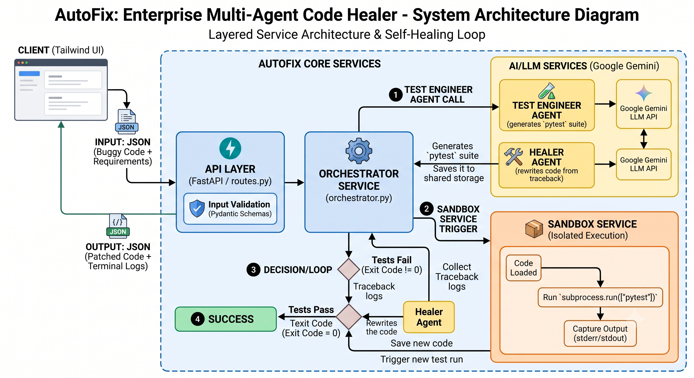

# 🤖 AutoFix: Enterprise Multi-Agent Code Healer

[](https://www.python.org)
[](https://fastapi.tiangolo.com)
[](https://ai.google.dev/)
[](https://tailwindcss.com/)

> **Write code. Break it. Let the AI agents fix it.**  
> An automated CI/CD debugging pipeline where specialized AI agents write tests, execute them in a secure sandbox, analyze the crash logs, and patch the source code autonomously.

---

## 🌐 Live Application

<div align="center">

[](https://your-deployment-link.com)

👉 **[Experience AutoFix Live in Your Browser](https://your-deployment-link.com)** 👈

*No installation required. Paste broken code and watch the self-healing multi-agent loop resolve defects in real time.*

</div>

---

## 🎯 The Mission
In modern software development, the gap between Quality Assurance testing and Software Engineering often slows down delivery. **AutoFix** bridges this exact gap. 

By upgrading the traditional automated testing mindset (like Selenium or TestNG) with modern LLM orchestration, this tool acts as an autonomous QA-to-Developer pipeline. It proves that testing doesn't just have to *find* bugs—it can actively *resolve* them.

---

## 🏛️ System Architecture

AutoFix uses a **Layered Service Architecture**, separating HTTP routing, data validation, pure business logic, and AI prompt engineering.



### Directory Structure
```text
autofix-pipeline/
├── .env                     # API Keys & Secrets
├── requirements.txt         # Project Dependencies
├── pro.png                  # Architecture Diagram 
├── workspace/               # Local Execution Sandbox
└── app/                     
    ├── main.py              # Application Entry Point
    ├── api/                 # REST Endpoints
    ├── core/                # Configuration & System Prompts
    ├── models/              # Pydantic Validation Schemas
    ├── services/            # Sandbox & CI/CD Orchestration
    ├── agents/              # AI Persona Logic
    └── static/              # HTML/JS/CSS Frontend